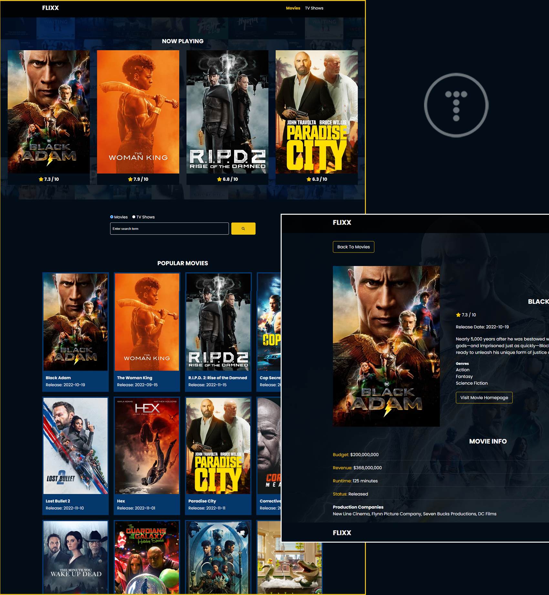

# Flixx App

Um simples AppWeb que foi realizado usando puramente vanilla Javascript (sem frameworks),
juntamente com a versão 3 do [TMDB API](https://developers.themoviedb.org/3)

Esse projeto faz parte do curso **Modern JS From The Beginning 2.0** 

O projeto inclui os filmes e séries mais populares da atualidade, um campo de pesquisa para busca de filmes e seriados com uma página completa de retorno. Um slider logo abaixo com os filmes que estão atualmente em cartaz no cinema. O slider usa a biblioteca [Swiper](https://swiperjs.com).

## Instruções

Faça o clone ou o download completo desse repositório, depois registre uma API gratuita no seguinte 
endereço: https://www.themoviedb.org/settings/api

Após obter a sua chave API, adicione em `api.apiKey` no global da página.
Once you get your key, just add it to the `api.apiKey` value in the global state at the top.

**Nota:** Se você quiser usar esse projeto como produção, você não deve armazenar no cliente. Você deve criar um Servidor Proxy e guardar a sua chave API lá.

## Theme (HTML & CSS)
Aqui também há um tema com o HTML e CSS, sempre aconselhável mudar o tema para o projeto atual.
